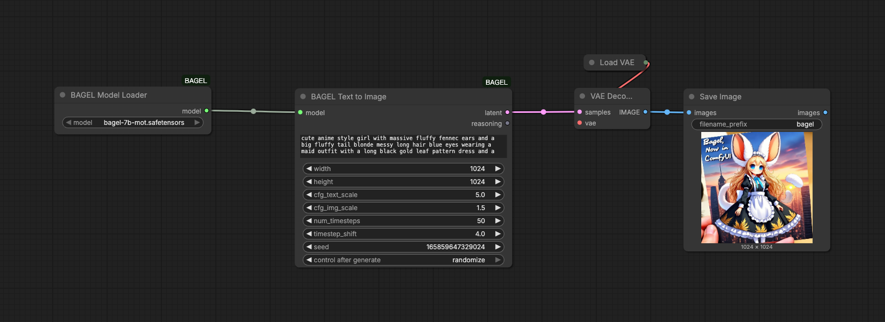
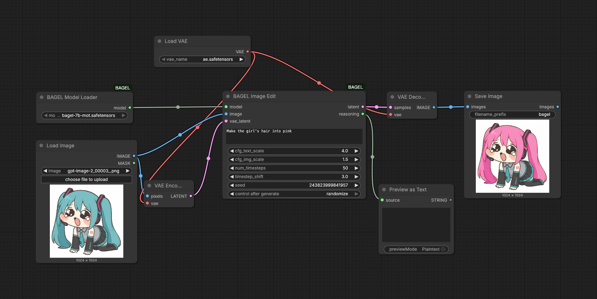
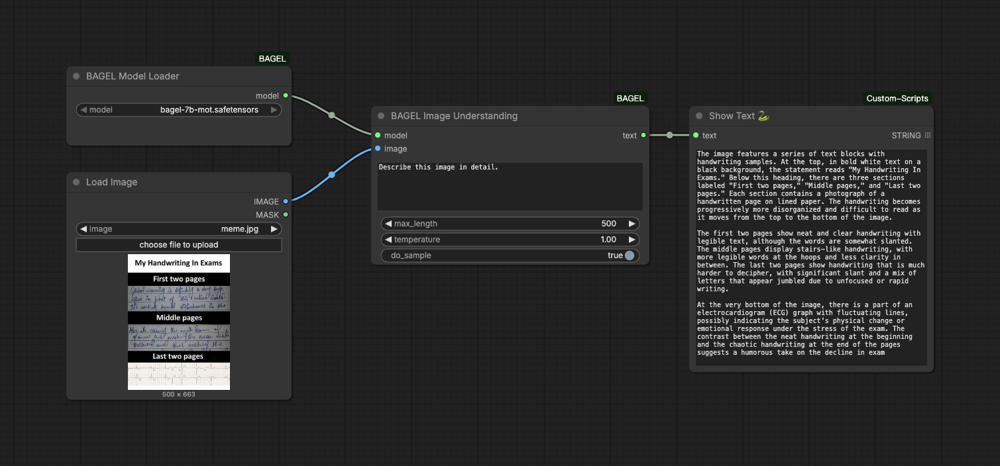

# ComfyUI-BAGEL

A ComfyUI custom node package for BAGEL-7B-MoT with native ComfyUI model loading.

<p align="center">
  
</p>

## Model paths

| Component | Recommended source | Put it here | Loaded by |
| --- | --- | --- | --- |
| BAGEL main model | [`6chan/bagel_comfy`](https://huggingface.co/6chan/bagel_comfy) single-file `.safetensors` | `ComfyUI/models/bagel/` | `BAGEL Model Loader` |
| FLUX AE / VAE | `ae.safetensors` for FLUX | `ComfyUI/models/vae/` | official `VAELoader`, `VAEEncode`, `VAEDecode` |
| Qwen tokenizer | bundled in this repository | no manual install | `BAGEL Model Loader` |
| BAGEL model configs | built into the node; optional metadata can override them | no manual install | `BAGEL Model Loader` |
| Old HF shard layout | `ByteDance-Seed/BAGEL-7B-MoT`, `DFloat11/BAGEL-7B-MoT-DF11` | `ComfyUI/models/bagel/` | deprecated legacy nodes |

> Recommended: download the single-file model from `6chan/bagel_comfy`.
> If you already have the original BAGEL checkpoint, either convert it with
> `scripts/convert_bagel_model.py` or re-download the converted file. The
> converter embeds and validates the `comfyui_bagel` metadata header, including
> the model configs needed by the native loader.
> If the Hugging Face repository also contains config files, treat them as
> conversion/audit references. The native ComfyUI loader does not require users
> to copy config files into `models/bagel`.

## Install

1. Clone this repository into `ComfyUI/custom_nodes/ComfyUI-BAGEL`.
2. Install the node-specific dependencies:

   ```bash
   cd ComfyUI/custom_nodes/ComfyUI-BAGEL
   pip install -r requirements.txt
   ```

3. Download a BAGEL `.safetensors` from [`6chan/bagel_comfy`](https://huggingface.co/6chan/bagel_comfy) into `ComfyUI/models/bagel/`.
4. Put FLUX `ae.safetensors` into `ComfyUI/models/vae/`.
5. Restart ComfyUI and load one of the native workflows below.

### Existing old-model users

| Current state | Recommended action |
| --- | --- |
| You already downloaded `ByteDance-Seed/BAGEL-7B-MoT` | Convert it with `scripts/convert_bagel_model.py`, or re-download the converted single-file model. |
| You already downloaded `DFloat11/BAGEL-7B-MoT-DF11` | Keep using deprecated workflows for now, or convert/re-download when a converted quantized release is available. |
| You have old all-in-one BAGEL workflows | Use the `_deprecated` workflow files and deprecated nodes, then migrate to native workflows. |

Legacy auto-download and all-in-one loader instructions were moved to
[`docs/deprecated-installation.md`](docs/deprecated-installation.md).

## Workflows







| Workflow | File | Extra nodes | Notes |
| --- | --- | --- | --- |
| Text-to-image | `example_workflows/bagel_text_to_image.json` | none | Native BAGEL latent generation, official `VAEDecode`. |
| Image editing | `example_workflows/bagel_image_editing.json` | official `ImageScale`, `VAEEncode`, `VAEDecode` | Resize the source image before both `VAEEncode` and `BAGEL Image Edit`; use 16-aligned dimensions, with a 512–1024px range matching the original BAGEL preprocessing. |
| Image understanding | `example_workflows/bagel_image_understanding.json` | `ShowText|pysssss` from `comfyui-custom-scripts`, or replace with official `Preview as Text` on newer ComfyUI | VIT/text path only; no VAE nodes required. |
| Deprecated text-to-image | `example_workflows/bagel_text_to_image_deprecated.json` | `comfyui-custom-scripts` | Old all-in-one loader. |
| Deprecated image editing | `example_workflows/bagel_image_editing_deprecated.json` | `comfyui-custom-scripts` | Old all-in-one loader. |
| Deprecated image understanding | `example_workflows/bagel_image_understanding_deprecated.json` | `comfyui-custom-scripts` | Old all-in-one loader. |

## Model and runtime matrix

| Path | Model source | File layout | Nodes | VAE | Status |
| --- | --- | --- | --- | --- | --- |
| Native BF16 | `6chan/bagel_comfy` | single `.safetensors` in `models/bagel` | `BAGEL*` native nodes | official FLUX AE | recommended |
| Converted local BF16 | original `ByteDance-Seed/BAGEL-7B-MoT` converted by script | single `.safetensors` in `models/bagel` | `BAGEL*` native nodes | official FLUX AE | supported |
| Legacy standard | original HF shard folder | folder in `models/bagel` | `Bagel* (Deprecated)` | internal legacy VAE | compatibility only |
| Legacy DFloat11 | DFloat11 HF folder | folder in `models/bagel` | `Bagel* (Deprecated)` | internal legacy VAE | compatibility only |

| Task | Recommended workflow | Expected VRAM | Current validation |
| --- | --- | --- | --- |
| Text-to-image | native BF16 + official VAE decode | A100-class / high-VRAM GPU recommended | ran on Modal A100; exact benchmark pending |
| Image editing | native BF16 + official VAE encode/decode | A100-class / high-VRAM GPU recommended | ran on Modal A100; exact benchmark pending |
| Image understanding | native BF16, no VAE | lower than generation/editing, still needs BAGEL loaded | workflow prepared; run on remote GPU |
| Legacy DFloat11 generation | deprecated workflows | 21.76 GB reported for 1024x1024 | old README reported 154.39 s on RTX 4090 |
| Legacy standard generation | deprecated workflows | 30.07 GB reported for 1024x1024 | old README reported 482.95 s on RTX 4090 |

## TODO: model variant support

Future BAGEL variants will be tracked from the
[`6chan/bagel`](https://huggingface.co/collections/6chan/bagel) collection. The
support path depends on each model's file format, modality inputs, and inference
logic.

| Variant family | Example models in collection | Input / output shape | Planned ComfyUI support |
| --- | --- | --- | --- |
| Base BAGEL any-to-any | `ByteDance-Seed/BAGEL-7B-MoT`, `6chan/bagel_comfy` | text, image, latent -> text/image | current native nodes |
| Image editing / NHR editing | `iitolstykh/Bagel-NHR-Edit`, `Bagel-NHR-Edit-V2` | image + edit prompt -> image | first try native image-edit adapter; add a dedicated edit node if prompt/image order differs |
| Reasoning / VQA variants | `multimodal-reasoning-lab/Bagel-Zebra-CoT`, `sensenova/SenseNova-SI-1.1-BAGEL-7B-MoT` | image + text -> text | adapt `BAGEL Image Understanding`; add reasoning-specific controls if needed |
| Text-to-image variants | `Wayne-King/SRUM_BAGEL_7B_MoT`, `Ryann829/Scone`, `LLM-Drop/*GEN*`, `Yanran21/UniGenDet` | text -> image | adapt `BAGEL Text to Image`; add model-specific generation options only when required |
| SIGMA variants | SIGMA checkpoints in the collection and related releases | style/subject or structured conditioning -> image | add a SIGMA-specific loader/conditioning node after its checkpoint metadata and reference workflow are verified |
| Quantized formats | `DFloat11/*`, FP8, INT8, GGUF, AutoRound INT4 | same tasks, different weight format/runtime | separate loader/converter path; do not mix into the BF16 loader unless the state dict is compatible |
| Specialized any-to-any / composition | `ThinkMorph`, `Uni-Edit`, `UniCorn`, `ConsistCompose`, `Echo-4o`, `SenseNova-Vision` | may add multi-image, identity, composition, or agentic conditioning | inspect model card + sample code first; add new nodes when graph inputs differ from the base BAGEL tasks |

| Support stage | Acceptance gate |
| --- | --- |
| Catalog | Add model to a comparison table with source, license, task, file format, expected VRAM, and required nodes. |
| Load | Converted or downloaded model appears in the correct ComfyUI model folder and loads without auto-downloading pipeline code. |
| Smoke test | One minimal workflow runs on a remote GPU for the model's primary task. |
| Workflow | Add or update an example workflow with official ComfyUI nodes where possible. |
| Benchmark | Record GPU, VRAM peak, image size, steps, and wall-clock time. |

## Contribution

Contributions are welcome. Please open an issue for compatibility problems,
variant support requests, or proposed changes before submitting a pull request.
For code changes, include the affected workflow and the ComfyUI version used for
validation when possible.

## FAQ

### Which model should I download?

Use the single-file converted checkpoints from
[`6chan/bagel_comfy`](https://huggingface.co/6chan/bagel_comfy). The native loader
does not require users to copy the original BAGEL config files into
`models/bagel`.

### Which VAE should I use?

Load the FLUX autoencoder with the official `VAELoader`, then connect it to
`VAEEncode`/`VAEDecode`. The native BAGEL nodes do not load a private pipeline
VAE.

### What image sizes are supported for editing?

Resize the source image before both `VAEEncode` and `BAGEL Image Edit`. Use
16-aligned dimensions, normally with the short side at least 512 px and the
long side at most 1024 px.

### Can I still use an original BAGEL or DFloat11 model?

Yes, but use the deprecated workflows and nodes. For native workflows, convert
the checkpoint or download the matching single-file release.

## Related links

| Resource | Link |
| --- | --- |
| BAGEL paper | https://arxiv.org/abs/2505.14683 |
| BAGEL homepage | https://bagel-ai.org/ |
| Original BAGEL model | https://huggingface.co/ByteDance-Seed/BAGEL-7B-MoT |
| Recommended converted ComfyUI model | https://huggingface.co/6chan/bagel_comfy |
| BAGEL variant collection | https://huggingface.co/collections/6chan/bagel |
| Online demo | https://demo.bagel-ai.org/ |

## License

This project is licensed under the Apache 2.0 License. Please refer to the
official license terms for the use of the BAGEL model.
