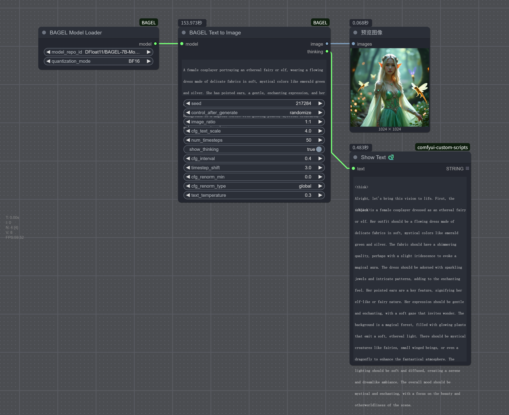
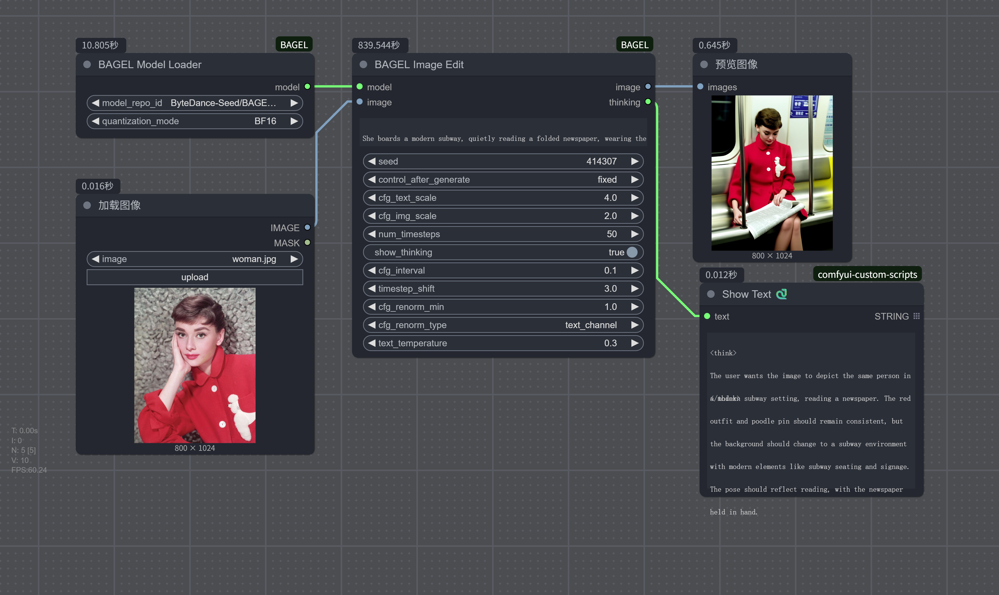
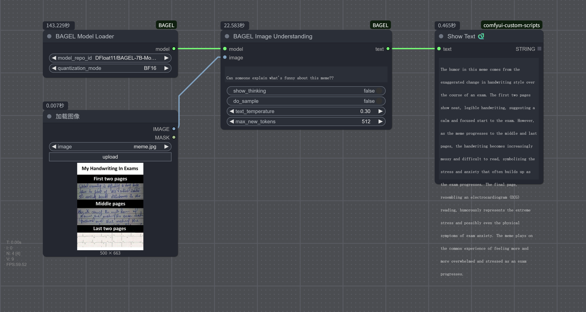

# ComfyUI-Bagel

A ComfyUI custom node package based on the BAGEL-7B-MoT multimodal model.

## About BAGEL

<p align="center">
  
</p>

BAGEL is an open-source multimodal foundation model with 7B active parameters (14B total) that adopts a Mixture-of-Transformer-Experts (MoT) architecture. It is designed for multimodal understanding and generation tasks, outperforming top-tier open-source VLMs like Qwen2.5-VL and InternVL-2.5 on standard multimodal understanding leaderboards, and delivering text-to-image quality competitive with specialist generators such as SD3.

## Features

- **Text-to-Image Generation**: Generate high-quality images using natural language prompts
- **Image Editing**: Edit existing images based on textual descriptions  
- **Image Understanding**: Perform Q&A and analysis on images
- **Reasoning Process Display**: Optionally display the model's reasoning process
- **DFloat11 Quantized Model Support**: Support for DFloat11 quantized version that requires only ~22GB VRAM

## Installation

### 1. Model Selection and Download
The ComfyUI-Bagel node now supports automatic model selection via dropdown:
- **ByteDance-Seed/BAGEL-7B-MoT**: Original standard model (~80GB VRAM recommended)
- **DFloat11/BAGEL-7B-MoT-DF11**: Quantized model (~22GB VRAM, single 24GB GPU compatible)

Models will be automatically downloaded to `models/bagel/` when first selected. You can also manually download them:

#### Standard Model
```bash
# Clone model using git lfs (recommended)
git lfs install
git clone https://huggingface.co/ByteDance-Seed/BAGEL-7B-MoT models/bagel/BAGEL-7B-MoT

# Or use huggingface_hub
pip install huggingface_hub
python -c "from huggingface_hub import snapshot_download; snapshot_download(repo_id='ByteDance-Seed/BAGEL-7B-MoT', local_dir='models/bagel/BAGEL-7B-MoT')"
```

#### DFloat11 Quantized Model (Recommended for single GPU)
```bash
# Clone DFloat11 quantized model
git clone https://huggingface.co/DFloat11/BAGEL-7B-MoT-DF11 models/bagel/BAGEL-7B-MoT-DF11

# Or use huggingface_hub
python -c "from huggingface_hub import snapshot_download; snapshot_download(repo_id='DFloat11/BAGEL-7B-MoT-DF11', local_dir='models/bagel/BAGEL-7B-MoT-DF11')"
```

### 2. Install Dependencies
Install the required dependencies:
```bash
pip install -r requirements.txt
```

For DFloat11 quantized model support, also install:
```bash
pip install dfloat11
```

### 3. Restart ComfyUI
Restart ComfyUI to load the new nodes.

## Workflows

### Text-to-Image Generation

Generate high-quality images from text descriptions. Suitable for creative design and content generation.

### Image Editing Workflow

Edit existing images based on textual descriptions, supporting local modifications and style adjustments.

### Image Understanding Workflow

Analyze and answer questions about image content, suitable for content understanding and information extraction.

## Performance Comparison

| Metric | BAGEL-7B-MoT (Standard Model) | BAGEL-7B-MoT (DFloat11 Quantized Model) |
|--------|-------------------------------|-----------------------------------------|
| Model Size | 29.21 GB | 19.89 GB |
| Peak GPU Memory (1024x1024 image generation) | 30.07 GB | 21.76 GB |
| Generation Time (on an RTX4090 GPU) | 482.95 seconds | 154.39 seconds |

DFloat11 Quantized Model significantly reduces VRAM requirements and speeds up generation time, making it ideal for single GPU setups.

## Related Links

- [BAGEL Official Paper](https://arxiv.org/abs/2505.14683)
- [BAGEL Model Homepage](https://bagel-ai.org/)
- [Hugging Face Model](https://huggingface.co/ByteDance-Seed/BAGEL-7B-MoT)
- [Online Demo](https://demo.bagel-ai.org/)
- [Discord Community](https://discord.gg/Z836xxzy)

## License

This project is licensed under the Apache 2.0 License. Please refer to the official license terms for the use of the BAGEL model.

## Contribution

Contributions are welcome! Please submit issue reports and feature requests. If you wish to contribute code, please create an issue to discuss your ideas first.

## FAQ

### 1. VRAM Requirements
The official recommendation for generating a 1024×1024 image is over 80GB GPU memory. However, multi-GPU setups can distribute the memory load. For example:
- **Single GPU**: A100 (40GB) takes approximately 340-380 seconds per image.
- **Multi-GPU**: 3 RTX3090 GPUs (24GB each) complete the task in about 1 minute.
- **Compressed Model**: Using the DFloat11 version requires only 22GB VRAM and can run on a single 24GB GPU, with peak memory usage around 21.76GB (A100) and generation time of approximately 58 seconds.

For more details, visit the [GitHub issue](https://github.com/ByteDance-Seed/Bagel/issues/4).

### 2. Quantized Version
A quantized version of BAGEL is currently under development, which aims to reduce VRAM requirements further.

### 3. NameError: 'Qwen2Config' is not defined
This issue is likely related to environment or dependency problems. For more information, refer to [this GitHub issue](https://github.com/neverbiasu/ComfyUI-BAGEL/issues/7).
